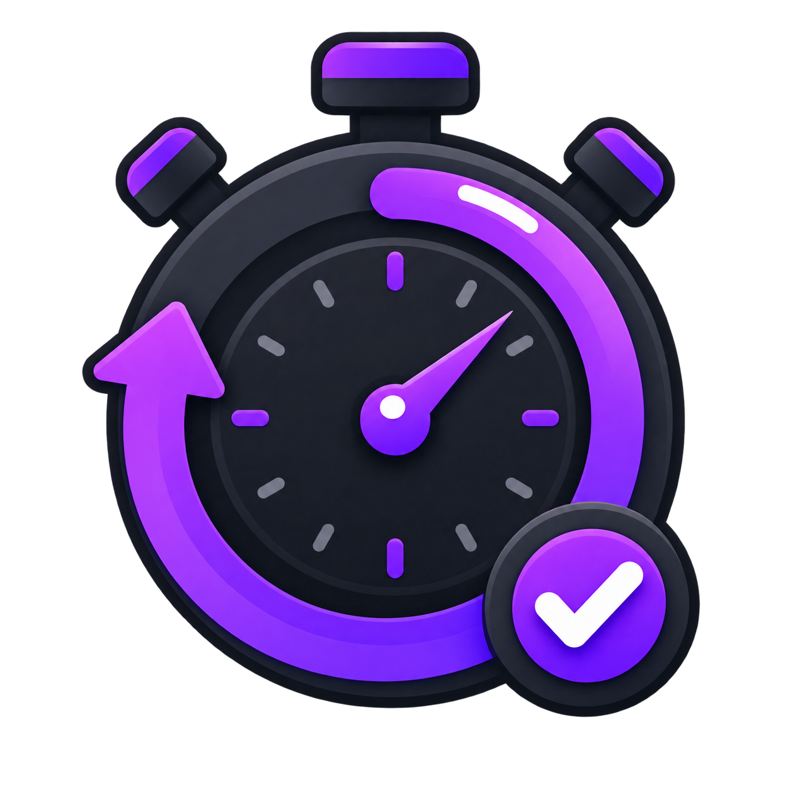

# Rep Counter



Rep Counter is a small native Windows workout timer. Set a rep target and rest duration, complete each rep, and receive an audible and visual cue when it is time to continue.

Current version: **v0.5.0-alpha**

## Features

- First rep starts immediately by default, with an optional initial delay.
- Rest duration uses seconds and includes 30, 60, and 90 second presets.
- Pause/resume and skip-rest controls.
- Reset and cancel controls without restarting the app.
- Three synthesized alert styles with mute and volume controls; no external audio files are required.
- Keyboard navigation, focus indicators, shortcuts, and Per-Monitor V2 DPI scaling.
- Responsive native dark-mode interface.

## Requirements

- Windows 10 version 1607 or newer, or Windows 11.
- CMake 3.20 or newer.
- Visual Studio 2022 Build Tools with the **Desktop development with C++** workload.

## Build and run

```powershell
cmake -S . -B build -DBUILD_TESTING=ON
cmake --build build --config Release
ctest --test-dir build -C Release --output-on-failure
.\build\Release\rep_counter.exe
```

The executable is self-contained and can run from any working directory.

## Keyboard shortcuts

| Shortcut | Action |
| --- | --- |
| Enter | Start workout, complete a ready rep, or begin a new workout |
| Escape | Cancel the active workout |
| Ctrl+N | Start a new workout |
| Ctrl+P | Pause or resume rest |
| Ctrl+S | Skip the current rest |
| Tab / Shift+Tab | Move keyboard focus |

## Create a portable package

```powershell
cmake --install build --config Release --prefix build\install
cpack --config build\CPackConfig.cmake -C Release
```

CPack creates `Rep-Counter-0.5.0-alpha-windows-x64.zip` in the repository root. An NSIS installer can also be generated with `cpack -G NSIS` when NSIS is installed.

## Project structure

- `src/main.cpp` — native Win32 presentation, audio, and application lifetime.
- `include/workout_session.hpp` and `src/workout_session.cpp` — testable workout state machine.
- `tests/` — deterministic timer and state-transition tests.
- `resources/` — Windows manifest, icon, and executable metadata.
- `.github/workflows/` — Windows build/test/package and security analysis.

## Troubleshooting

- If CMake cannot find a compiler, install the Visual Studio C++ workload and run the build from a Developer PowerShell.
- If no sound plays, confirm Mute is off and raise the in-app and Windows output volume.
- On high-DPI displays, Windows should rescale the UI after it moves between monitors. Please report layout issues with the display scaling percentage.

## Contributing and security

See [CONTRIBUTING.md](CONTRIBUTING.md) for development guidance. Please report vulnerabilities privately using the process in [SECURITY.md](SECURITY.md), not through a public issue.

## License

Rep Counter is licensed under GPL-3.0-only. See [LICENSE](LICENSE). The app icon was generated for this project with OpenAI's built-in image generation tool. Alert tones are synthesized at runtime and do not use redistributed recordings.
